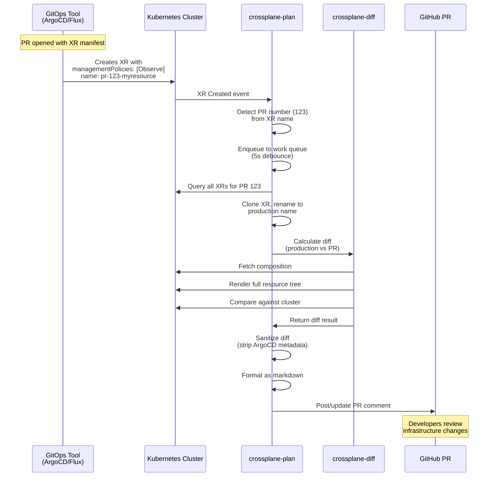
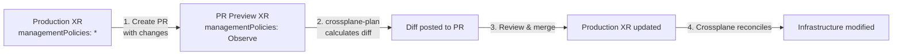

# crossplane-plan

> Terraform plan for ArgoCD-managed Crossplane

⚠️ **Early Release**: This tool requires ArgoCD to manage your Crossplane resources. Flux support is planned.

## Overview

`crossplane-plan` integrates with ArgoCD to automatically post infrastructure change previews to GitHub pull requests, similar to how Terraform Cloud provides plan comments.

**Key Features:**
- 🔄 **GitOps-native**: Leverages ArgoCD's diff engine for accurate deletion detection
- 📊 **Composition preview**: Shows what managed resources your XRs will create
- 🎯 **Scope-aware**: Automatically isolates changes per ArgoCD Application
- 🚀 **Zero configuration**: Works with standard ArgoCD ApplicationSets out of the box
- 📦 **Bare resource support**: Diffs both XRs and standalone managed resources

## Architecture

- **XR Watcher**: Monitors XRs via Kubernetes watch API with leader election (HA-ready)
- **PR Detector**: Extracts PR number from XR name using pattern matching
- **Diff Calculator**: Uses [crossplane-diff](https://github.com/crossplane-contrib/crossplane-diff) library for accurate composition rendering
- **VCS Client**: Posts formatted diffs to GitHub
- **Work Queue**: Debounces updates to prevent comment spam (5-second window)

## PR Detection

Currently supports **name-based detection only**:

Extracts PR number from XR name using pattern: `pr-{number}-*`

```yaml
# Example: pr-123-mill → PR #123
apiVersion: platform.millstone.tech/v1alpha1
kind: XGitHubRepository
metadata:
  name: pr-123-mill
```

**Note**: Label-based and annotation-based detection are planned but not yet implemented.

## Deployment

### Prerequisites

- Kubernetes cluster with Crossplane installed
- **ArgoCD managing your Crossplane resources** (see [ArgoCD Setup](#argocd-setup))
- GitHub repository
- Helm 3.x

### ArgoCD Setup

crossplane-plan works with any ArgoCD Application that creates PR preview environments. **ApplicationSets make this much easier**, but you can also create Applications manually or via CI/CD.

**What crossplane-plan needs:**
1. An ArgoCD Application exists for each PR (named with pattern containing PR number)
2. Resources are created with naming pattern: `pr-{number}-{base-name}`
3. XRs have `managementPolicies: [Observe]` for safety
4. ArgoCD's automatic labels are present (happens automatically)

#### Option A: ApplicationSet (Recommended - Automated)

The easiest way - ArgoCD automatically creates/destroys Applications per PR:

```yaml
apiVersion: argoproj.io/v1alpha1
kind: ApplicationSet
metadata:
  name: crossplane-preview
spec:
  generators:
    - pullRequest:
        github:
          owner: myorg
          repo: myrepo
        requeueAfterSeconds: 30
  template:
    metadata:
      name: 'crossplane-pr-{{number}}'
    spec:
      project: default
      source:
        repoURL: https://github.com/myorg/myrepo
        targetRevision: '{{head_sha}}'
        path: crossplane
        helm:
          values: |
            namePrefix: pr-{{number}}-
            managementPolicies: ["Observe"]
      destination:
        server: https://kubernetes.default.svc
        namespace: crossplane-system
```

**Pros:**
- ✅ Fully automated (creates/destroys apps with PRs)
- ✅ Uses ArgoCD's PR generator (tracks PR state)
- ✅ No manual intervention

#### Option B: Manual Application Creation (Harder Way)

If you don't use ApplicationSets, you can create Applications manually or via CI/CD:

```bash
# When PR opens, create Application
argocd app create crossplane-pr-123 \
  --repo https://github.com/myorg/myrepo \
  --revision refs/pull/123/head \
  --path crossplane \
  --dest-server https://kubernetes.default.svc \
  --dest-namespace crossplane-system \
  --helm-set namePrefix=pr-123- \
  --helm-set-string managementPolicies[0]=Observe

# When PR closes, delete Application
argocd app delete crossplane-pr-123
```

Or create Application resources in CI/CD:

```yaml
apiVersion: argoproj.io/v1alpha1
kind: Application
metadata:
  name: crossplane-pr-123
spec:
  project: default
  source:
    repoURL: https://github.com/myorg/myrepo
    targetRevision: refs/pull/123/head
    path: crossplane
    helm:
      values: |
        namePrefix: pr-123-
        managementPolicies: ["Observe"]
  destination:
    server: https://kubernetes.default.svc
    namespace: crossplane-system
```

**Pros:**
- ✅ More control over Application lifecycle
- ✅ Can integrate with custom CI/CD workflows

**Cons:**
- ❌ Manual creation/deletion required
- ❌ Need to track PR open/close events
- ❌ More infrastructure to manage

#### How crossplane-plan Uses ArgoCD

ArgoCD automatically adds labels to all resources it manages:
```yaml
metadata:
  labels:
    argocd.argoproj.io/instance: crossplane-pr-123
```

crossplane-plan uses these labels to:
- **Discover scope**: Which resources belong to which PR
- **Find production**: Strips `pr-{number}-` prefix to find production Application
- **Detect deletions**: Uses ArgoCD's diff to compare apps

**No crossplane-plan configuration needed** - it just works with ArgoCD's automatic labeling!

### Why kubedock?

crossplane-plan uses kubedock as a sidecar container to provide a Docker API inside the pod. This is necessary because:

1. **crossplane-diff requires Docker** - The underlying crossplane-diff library executes Crossplane composition functions, which run as Docker containers
2. **Functions run during diff calculation** - To accurately render compositions, crossplane-diff needs to execute the same functions that Crossplane would run
3. **No Docker daemon in containers** - Standard Kubernetes pods don't have access to Docker, so kubedock provides a virtualized Docker API that translates Docker commands to Kubernetes pods

**Security**: kubedock runs as a non-root user with minimal privileges and no host Docker socket access.

### Install with Helm

```bash
# Add Helm repository (when published)
helm repo add millstone https://millstonehq.github.io/charts
helm repo update

# Install crossplane-plan
helm install crossplane-plan millstone/crossplane-plan \
  --namespace crossplane-system \
  --set github.repo=myorg/myrepo \
  --set github.credentialsSecretName=github-creds
```

### Create GitHub Credentials Secret

```bash
kubectl create secret generic github-creds \
  --namespace crossplane-system \
  --from-literal=credentials='{"token":"ghp_yourtokenhere"}'
```

### Configuration Options

See [values.yaml](charts/crossplane-plan/values.yaml) for all configuration options:

```yaml
# Key configuration values
detection:
  strategy: name
  namePattern: "pr-{number}-*"

github:
  repo: "myorg/myrepo"
  credentialsSecretName: github-creds

config:
  diff:
    stripDefaults: true  # Hide deployment-specific fields
    stripRules: []       # Add custom field exclusions
```

## Development

### Prerequisites

- Go 1.25+
- Kubernetes cluster with Crossplane installed
- GitHub credentials for posting comments

### Local Development

```bash
# Install dependencies
go mod download

# Run locally (requires kubeconfig)
go run cmd/crossplane-plan/main.go \
  --detection-strategy=name \
  --name-pattern='pr-{number}-*' \
  --github-repo=millstonehq/mill
```

### Testing

```bash
# Run unit tests
go test ./...

# Run with verbose output
go test -v ./...
```

### Building

```bash
# Build binary locally
earthly +build

# Build container image
earthly +image --tag=latest

# Run all checks (test + lint + build)
earthly +all

# Publish multi-arch images to registry
earthly --push +publish --tag=v0.1.0
```

## How It Works



### Detailed Workflow

1. **Watch XRs**: Monitors all Crossplane XRs in the cluster using Kubernetes watch API
2. **Detect PR**: Extracts PR number from XR name/labels/annotations using configured strategy
3. **Batch Processing**: Groups all XRs for the same PR number (debounced 5 seconds)
4. **Clone & Rename**: Creates copy of PR XR with production name for accurate diff
5. **Calculate Diff**:
   - Uses crossplane-diff to render full composition tree
   - Compares PR manifest against production resources
   - Detects deletions (resources in production but not in PR)
6. **Sanitize**: Strips deployment-specific fields (ArgoCD annotations, management policies)
7. **Format Output**: Generates markdown-formatted diff with collapsible sections
8. **Post Comment**: Creates/updates GitHub PR comment with preview

## Why crossplane-diff Library?

- **Maintained by community**: crossplane-contrib maintains the complex composition logic
- **Complete rendering**: Shows XR + all managed resources created by composition
- **Accurate composition**: Uses actual Crossplane composition engine (not simulation)
- **Handles edge cases**: Nested XRs, composition changes, schema validation, requirements
- **Provider-agnostic**: Works with ANY Crossplane provider
- **Established**: Battle-tested standalone CLI tool with comprehensive test coverage

## Workflows & Prerequisites

### What Must Exist in the Cluster

For crossplane-plan to work correctly, you need:

1. **Production resources in the cluster** - The tool compares PR manifests against existing production resources. Without production resources to diff against, you'll only see "new resource" diffs.

2. **XRDs and Compositions deployed** - These define how XRs are rendered. They must exist in the cluster and be accessible to crossplane-plan.

3. **Correct managementPolicies scope**:
   - ✅ **XRDs and Compositions**: Keep at `managementPolicies: [*]` (or omit - defaults to full management)
   - ✅ **Production XR instances**: Use `managementPolicies: [*]` or specific policies like `[Create, Update, Delete]`
   - ✅ **PR preview XR instances**: Use `managementPolicies: [Observe]` for safety

**Critical**: Do NOT set `managementPolicies: [Observe]` on XRDs or Compositions themselves - this prevents them from rendering XRs. Only set Observe on the actual XR instances (the resources that reference the XRDs).

### Common Workflow Scenarios

#### Workflow 1: Import Existing Infrastructure (Observe → Iterate → Manage)

**Use case**: Bringing existing cloud resources under Crossplane management without disruption.

**Goal**: Adopt pre-existing infrastructure by first observing it, iterating until your spec matches reality, then enabling full management.


**Step-by-step**:

1. **Push to main with Observe mode first**:
   ```yaml
   apiVersion: example.org/v1alpha1
   kind: XDatabase
   metadata:
     name: prod-db
   spec:
     managementPolicies: [Observe]  # Read-only initially
     forProvider:
       instanceType: db.t3.medium   # Your best guess at current config
       allocatedStorage: 100
   ```

2. **Let Crossplane observe actual infrastructure**:
   - Crossplane queries the provider (AWS, GCP, etc.)
   - Populates `status.atProvider` with real values
   - You may see drift if your spec doesn't match reality

3. **Iterate until drift is zero**:
   - crossplane-plan will show drift between `spec.forProvider` (your declaration) and `status.atProvider` (actual infrastructure)
   - Update your spec to match actual infrastructure
   - Push updates to main (still in Observe mode)
   - Repeat until no drift is detected

4. **Switch to full management**:
   ```yaml
   spec:
     managementPolicies: [*]  # Now manage the resource
   ```
   - Crossplane now has permission to modify infrastructure
   - Any future spec changes will be applied to infrastructure

**Using PR previews during import**:

When you open a PR with changes during the import process (while production is still in Observe mode):

- ✅ **Drift IS reported** - crossplane-plan shows differences between your spec and actual infrastructure
- Both PR and production are in Observe mode, so both read from the same infrastructure
- The diff compares: PR spec vs actual infrastructure state (from `status.atProvider`)
- This is the **primary value** during import - iteratively fix drift in PRs before going to production
- Once drift is zero, merge to main and switch production to `managementPolicies: [*]`

**Example**:
```yaml
# Main branch: prod-db with managementPolicies: [Observe]
# PR branch: pr-123-prod-db with managementPolicies: [Observe]
# Both read from same AWS RDS instance
# Diff shows: spec says t3.medium, actual infrastructure is t3.large
# Update PR spec to t3.large, drift disappears
```

#### Workflow 2: Update Managed Infrastructure (Observe PR vs Managed Production)

**Use case**: Modifying infrastructure that Crossplane already fully manages.

**Goal**: Preview infrastructure changes in PRs before applying them to production.



**Step-by-step**:

1. **Production state** (main branch):
   ```yaml
   apiVersion: example.org/v1alpha1
   kind: XDatabase
   metadata:
     name: prod-db
   spec:
     managementPolicies: [*]  # Full management
     forProvider:
       instanceType: db.t3.medium
       allocatedStorage: 100
   ```

2. **Create PR with changes**:
   Your GitOps tool creates a PR preview:
   ```yaml
   apiVersion: example.org/v1alpha1
   kind: XDatabase
   metadata:
     name: pr-456-prod-db  # PR-specific name
   spec:
     managementPolicies: [Observe]  # Read-only for safety
     forProvider:
       instanceType: db.t3.large    # CHANGED
       allocatedStorage: 100
   ```

3. **crossplane-plan posts diff**:
   - Clones PR XR and renames to production name (`prod-db`)
   - Compares against actual production resource
   - Posts diff showing: `instanceType: db.t3.medium → db.t3.large`

4. **Merge to main**:
   - GitOps tool updates production XR with new spec
   - Production XR has `managementPolicies: [*]`, so changes are applied
   - Crossplane reconciles and modifies actual infrastructure

**What the diff shows**:
- ✅ Changes to managed resource specs (instance type, storage, etc.)
- ✅ New managed resources that would be created
- ✅ Managed resources that would be deleted
- ❌ Does NOT actually modify infrastructure (PR preview is read-only)

### Schema & Composition Requirements

For crossplane-plan to work, your Crossplane setup must:

#### 1. XRDs Must Support managementPolicies

Your XRD schema should include managementPolicies:

```yaml
apiVersion: apiextensions.crossplane.io/v1
kind: CompositeResourceDefinition
metadata:
  name: xdatabases.example.org
spec:
  group: example.org
  names:
    kind: XDatabase
  claimNames:
    kind: Database
  versions:
    - name: v1alpha1
      schema:
        openAPIV3Schema:
          type: object
          properties:
            spec:
              type: object
              properties:
                managementPolicies:  # REQUIRED for read-only mode
                  type: array
                  items:
                    type: string
                forProvider:
                  # Your resource-specific fields
```

**Why**: The `managementPolicies` field controls whether Crossplane reads-only or manages infrastructure. Without this field in your schema, you can't set Observe mode.

#### 2. Compositions Must Propagate managementPolicies

Your composition should pass managementPolicies to managed resources:

```yaml
apiVersion: apiextensions.crossplane.io/v1
kind: Composition
metadata:
  name: database-aws
spec:
  compositeTypeRef:
    apiVersion: example.org/v1alpha1
    kind: XDatabase
  resources:
    - name: rds-instance
      base:
        apiVersion: rds.aws.upbound.io/v1beta1
        kind: Instance
        spec:
          forProvider:
            # ... your config
      patches:
        - fromFieldPath: spec.managementPolicies
          toFieldPath: spec.managementPolicies  # Propagate to MR
```

**Why**: Without propagation, managed resources will use default policies (full management), even if the XR is in Observe mode. This defeats the purpose of read-only PR previews.

**Alternative**: Use a function to set managementPolicies conditionally:

```yaml
pipeline:
  - step: patch-management-policies
    functionRef:
      name: function-patch-and-transform
    input:
      apiVersion: pt.fn.crossplane.io/v1beta1
      kind: Resources
      patchSets:
        - name: propagate-management-policies
          patches:
            - fromFieldPath: spec.managementPolicies
              toFieldPath: spec.managementPolicies
```

#### 3. Providers Must Support managementPolicies

Ensure your Crossplane providers support management policies:
- ✅ All official Upbound providers (AWS, Azure, GCP, etc.)
- ✅ Most community providers (check provider docs)
- ❌ Some legacy providers may not support this feature

Check provider documentation or MR CRDs for the `managementPolicies` field.

### Troubleshooting Common Issues

**Issue: Diff shows "No production resource found"**

- **Cause**: Production resource doesn't exist in cluster yet
- **Solution**: This is expected for fresh resources. Use [Workflow 1: Import Existing Infrastructure](#workflow-1-import-existing-infrastructure-observe--iterate--manage) to adopt existing infrastructure first

---

**Issue: PR preview XR shows "not Ready"**

- **Cause**: XR in Observe mode is trying to observe infrastructure that doesn't exist
- **Solution**:
  - If importing: This is expected until infrastructure is created
  - If updating: Check that production resource name matches after PR prefix is stripped

---

**Issue: Diff shows changes to managementPolicies itself**

- **Cause**: Default field stripping is disabled
- **Solution**: Enable default stripping (see [Diff Exclusions](#diff-exclusions)). The managementPolicies difference between PR (Observe) and production (*) is expected and not meaningful for review

---

**Issue: Composed resources not rendering in PR preview**

- **Cause**: Likely one of:
  1. XRD or Composition has `managementPolicies: [Observe]` (should be `[*]` or omitted)
  2. Composition doesn't propagate managementPolicies to managed resources
  3. Provider CRDs don't support managementPolicies field
- **Solution**:
  1. Check XRD and Composition have full management policies
  2. Add managementPolicies propagation to composition (see [Schema Requirements](#2-compositions-must-propagate-managementpolicies))
  3. Upgrade provider if needed

## Integration with GitOps Tools

crossplane-plan is designed to work within a GitOps workflow with specific tool integration requirements.

### Required Setup

Your GitOps tool (ArgoCD, Flux, etc.) must:

1. **Create PR preview resources** with name-based identifiers:
   - Name pattern: `pr-{number}-{base-name}` (e.g., `pr-123-myapp`)
   - The tool extracts the PR number and strips the prefix to find the production resource

2. **Set management policies to read-only** for safety:
   ```yaml
   spec:
     managementPolicies: ["Observe"]
   ```
   This ensures PR previews don't modify actual infrastructure

3. **Use composition-based resources** - crossplane-plan only works with Composite Resources (XRs), not bare managed resources

### Example ArgoCD ApplicationSet

```yaml
apiVersion: argoproj.io/v1alpha1
kind: ApplicationSet
metadata:
  name: preview-environments
spec:
  generators:
    - pullRequest:
        github:
          owner: myorg
          repo: myrepo
  template:
    spec:
      source:
        helm:
          values: |
            nameOverride: pr-{{number}}-myapp
            managementPolicies: ["Observe"]
```

### Example Kustomize Patch

```yaml
apiVersion: kustomize.config.k8s.io/v1beta1
kind: Kustomization
nameSuffix: -pr-{{ .PR_NUMBER }}
patches:
  - patch: |-
      - op: replace
        path: /spec/managementPolicies
        value: ["Observe"]
    target:
      kind: XRDatabase  # Your XR kinds
```

## Diff Exclusions

To reduce noise, crossplane-plan automatically excludes certain fields from diffs. These exclusions are configurable via Helm values.

### Default Exclusions

The following fields are hidden by default (controlled by `config.diff.stripDefaults: true`):

| Field Path | Pattern | Reason |
|------------|---------|--------|
| `spec.managementPolicies` | Equals `["Observe"]` | PR previews forced to read-only mode for safety |
| `metadata.annotations` | `^argocd\.argoproj\.io/.*` | ArgoCD-managed tracking metadata (sync wave, tracking ID, etc.) |
| `metadata.labels` | `^crossplane\.io/composite$` | Crossplane composite resource tracking label |

### Why These Exclusions?

- **managementPolicies**: PR environments should always use `["Observe"]` to prevent accidental infrastructure changes. Production uses `["*"]` or specific policies. This difference is intentional and not meaningful for review.
- **ArgoCD annotations**: These change on every sync and are GitOps tool implementation details, not infrastructure configuration.
- **Crossplane labels**: Internal tracking labels that don't represent meaningful configuration changes.

### Custom Exclusions

Add additional field exclusions via Helm values:

```yaml
config:
  diff:
    stripDefaults: true  # Keep default exclusions
    stripRules:
      # Exact value match
      - path: "spec.myField"
        equals: "pr-value"
        reason: "PR-specific override"

      # Pattern match (for annotations/labels)
      - path: "metadata.annotations"
        pattern: "^my-company\.io/.*"
        reason: "Internal tracking metadata"
```

### Disabling Exclusions

To see all fields (useful for debugging):

```yaml
config:
  diff:
    stripDefaults: false
    stripRules: []
```

Fields excluded from diffs are listed in a collapsible footer of each PR comment for transparency.

## Caveats & Limitations

⚠️ **Important**: This tool has known limitations and assumptions. Understand these constraints before deploying to production:

### Architectural Limitations

#### 1. ArgoCD Required

**Limitation**: crossplane-plan currently only works with ArgoCD-managed Crossplane resources.

**Why**: The tool uses ArgoCD's automatic resource labeling (`argocd.argoproj.io/instance`) for scope detection and ArgoCD's diff engine for deletion tracking.

**Impact**: You must:
- Use ArgoCD to manage your Crossplane resources
- Use ArgoCD ApplicationSets for PR previews
- Have ArgoCD's standard labels on resources (automatic)

**Workaround**: None for current version.

**Future**: Flux support is planned (v0.2.0), other GitOps tools may be added based on community demand.

#### 2. PR Naming Requirements

**Limitation**: Resources must follow the naming pattern: `pr-{number}-{base-name}`

**Why**: crossplane-plan extracts the PR number from resource names to group XRs and find the corresponding GitHub PR.

**Impact**: Your ArgoCD ApplicationSet must create Applications with this pattern (standard for ArgoCD PR generators).

**Supported pattern**:
- Name: `pr-{number}-{base}` → extracts `123` from `pr-123-myapp`
- The tool strips the `pr-{number}-` prefix to find the production resource name

**Configuration**: Can be customized in Helm values if using a different pattern.

#### 3. Read-Only Preview Assumption

**Limitation**: The tool assumes PR previews use `managementPolicies: ["Observe"]` for safety.

**Why**: PR preview environments should never modify actual infrastructure. The read-only mode is a safety measure.

**Impact**: Diffs show what *would* change if deployed, but:
- PR resources won't actually modify infrastructure (by design)
- The diff compares "PR in read-only mode" vs "production with full management"
- This is intentional behavior, not a bug

**Stripping behavior**: By default, `managementPolicies: ["Observe"]` is hidden from diffs because it's an expected difference.

#### 4. Deletion Detection Limitations

**Limitation**: Can only detect deletions within resource types (GVKs) that exist in the PR.

**Why**: The tool finds deletions by comparing production resources of the same type (Group/Version/Kind) as PR resources.

**Impact**: If you:
- Remove a resource type entirely from your PR (e.g., delete all `XDatabase` resources)
- The tool won't detect that *other* production `XDatabase` resources would be deleted

**Example**:
```yaml
# Production has: XDatabase/prod-db-1, XDatabase/prod-db-2
# PR has: XRedis/pr-123-cache  (no databases at all)
# Result: Won't detect prod-db-1 and prod-db-2 deletions
```

**Workaround**: Include at least one resource of each type in your PR manifests.

#### 5. No Snapshot Consistency

**Limitation**: crossplane-diff doesn't take a cluster snapshot before processing.

**Why**: It's a live diffing tool that queries the cluster in real-time.

**Impact**: If cluster state changes during diff calculation (e.g., another reconcile happens), results may be inconsistent.

**Likelihood**: Low for most use cases (diffs complete quickly), but possible in heavily dynamic environments.

### Permission Requirements

**Limitation**: Requires extensive read permissions across the cluster.

**Why**: To accurately render compositions and calculate diffs, the tool needs to:
- Read XRDs, Compositions, Functions
- Read all XRs (to find PR vs production resources)
- Read environment configs
- Read CRDs for validation
- Traverse resource ownership trees

**Impact**: Typically deployed with cluster-admin or similar broad read access.

**Security consideration**: Runs with leader election, so only one replica actively queries the cluster.

### Operational Constraints

#### 6. Comment Spam Prevention

**Limitation**: 5-second debounce window on PR updates.

**Why**: Multiple XR events for the same PR are batched to avoid spamming PR comments.

**Impact**: There's a 5-second delay between XR changes and PR comment updates.

**Configurable**: This is hardcoded but could be made configurable if needed.

#### 7. GitHub Only (Currently)

**Limitation**: Only GitHub is supported for PR comments.

**Why**: GitLab and Bitbucket clients not yet implemented.

**Impact**: Cannot use with GitLab MRs or Bitbucket PRs.

**Future**: Planned for Phase 3 (see Roadmap).

### Design Tradeoffs

#### 8. Accuracy vs Performance

**Limitation**: The tool prioritizes accuracy over speed.

**Why**: crossplane-diff (the underlying library) is designed to "fail completely rather than emit potentially incorrect partial results."

**Impact**:
- Diffs may be slower for complex compositions
- Any error during rendering fails the entire diff
- No best-guess or partial results

**Philosophy**: Better to show no diff than an incorrect diff.

#### 9. Field Stripping Transparency

**Limitation**: Some fields are hidden from diffs by default.

**Why**: Reduce noise from deployment-specific metadata (ArgoCD annotations, management policies, etc.).

**Impact**: Actual differences in these fields are hidden.

**Transparency**: All stripped fields are listed in PR comment footer.

**Configurable**: Can disable with `stripDefaults: false`.

### Integration Assumptions

#### 10. GitOps Tool Must Create Resources

**Limitation**: Assumes a GitOps tool (ArgoCD/Flux) creates the PR preview XRs in the cluster.

**Why**: crossplane-plan watches for resources in the cluster - it doesn't create them itself.

**Impact**: You need a separate system to:
- Detect PR opens/updates
- Apply XR manifests to cluster with PR-specific naming
- Set management policies to Observe mode

**Not included**: PR webhook handling, manifest generation, or resource application logic.

### When NOT to Use crossplane-plan

❌ **Don't use if**:
- Working with bare managed resources (not XRs)
- Using non-composition-based Crossplane resources
- Need instant updates (5-second debounce may not be acceptable)
- Using GitLab or Bitbucket (not yet supported)
- Resources change names between PR and production (detection breaks)

✅ **Good fit if**:
- Using Crossplane compositions and XRs
- Have GitOps tool creating PR previews (ArgoCD/Flux)
- Want Terraform-style plan comments on GitHub PRs
- Willing to set up read-only PR preview environments
- Accept 5-second delay for batched updates

## Roadmap

- [x] Phase 1: Name-based detection, GitHub integration, Docker-based deployment
- [x] Phase 1.5: Kubernetes-native deployment with Helm, leader election, work queue
- [x] Phase 2: Open source release (currently available at [millstonehq/crossplane-plan](https://github.com/millstonehq/crossplane-plan))
- [ ] Phase 3: Label-based and annotation-based detection strategies
- [ ] Phase 4: GitLab and Bitbucket VCS client support
- [ ] Phase 5: Community feedback integration and stabilization
- [ ] Phase 6: Upstream contribution to crossplane-contrib (if appropriate)

### Potential Future Enhancements

These are NOT committed - just ideas for future exploration:

- **Bare managed resource support**: Add non-composition-based resource diffing (requires crossplane-diff changes)
- **Configurable debounce**: Make the 5-second work queue window configurable
- **Multiple VCS platforms**: Native support for GitLab MRs, Bitbucket PRs
- **Smarter deletion detection**: Detect deletions even when resource type is entirely removed from PR
- **Cluster snapshot mode**: Take consistent snapshot before diffing (accuracy vs performance tradeoff)
- **Reduced permission mode**: Support diffing with limited permissions (may sacrifice accuracy)
- **Dry-run mode enhancements**: Better local testing without cluster access

## Contributing

This project is open source and contributions are welcome!

**Repository**: [millstonehq/crossplane-plan](https://github.com/millstonehq/crossplane-plan)


### How to Contribute

1. **Read the caveats thoroughly** - Understand the current limitations before proposing changes
2. **Test in a non-production environment** - Ensure changes work in realistic scenarios
3. **Report issues** via [GitHub Issues](https://github.com/millstonehq/crossplane-plan/issues)
4. **Submit pull requests** to the [public repository](https://github.com/millstonehq/crossplane-plan)
5. **Share feedback** on design, limitations, and use cases

### Development Workflow

Since this project is synced from a private monorepo:
- PRs are accepted against the public repo
- Changes may be incorporated into the monorepo and re-synced
- Maintainers will work to keep the sync process transparent

### What We're Looking For

- Bug fixes and stability improvements
- Better documentation and examples
- Performance optimizations
- Additional VCS platform support (GitLab, Bitbucket)
- Detection strategy implementations (label-based, annotation-based)
- Community feedback on caveats and limitations

## License

Apache 2.0
